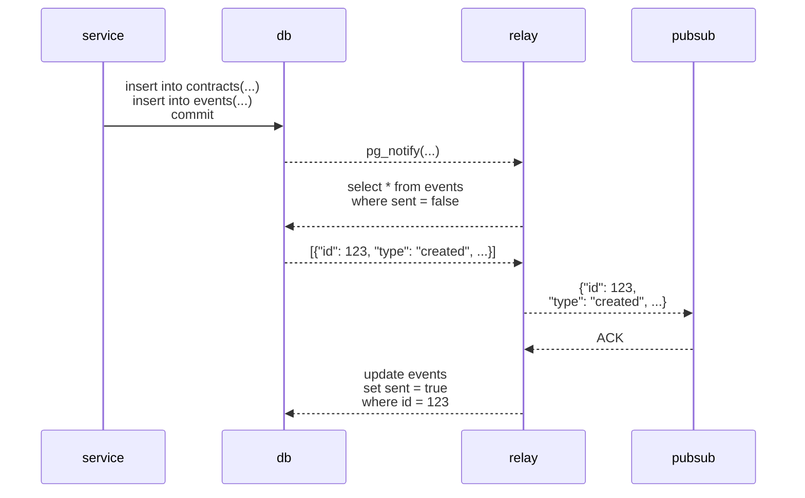

# Outbox Pattern MVP

The outbox pattern is used for reliable publishing of events. This is not reliable:

```go
func createContract() {
    db.Insert(&Contract{
        ID: "abc",
        Title: "Hello",
        Supplier: "Google Inc.",
    })
    pubsub.Publish("my-topic", Event{
        Type: "contract-created",
        ID: "abc",
    }.JSON())  // error! publish failed
}
```

The call to `pubsub.Publish` may fail. Or the program can crash right after commit and
before the call to `pubsub.Publish`. Or there's a network outage. In any case, you can't be
certain the message ever gets published.

The **outbox pattern** adds the event to be published in a separate table in the same database
transaction. The transaction is atomic, so either both the contract and event is
added to the database, or none of them are. 

A separate function picks up unpublished events and publishes them. After they
are published, they are marked as sent. The message delivery is at-least once.
The function could succeed at publishing the event, but fail to mark the event
as published.

The architecture is illustrated below.



## Relay: Postman Pat of The System
The relay is our Postman Pat in the system. He is responsible for figuring out whether there
are any events that are stored in the database that hasn't been sent. He can do that in two ways.
This MVP goes for the latter approach;

- **Pollling**: Periodically check the database for new unsent events.
- **Subscribe to database changes**: Whenever a new event is added, the database sends a notification to Postman Pat.

To set up a subscription in PostgresQL, we run `listen <topic>` and send a message
to a channel whenever a new event is received:
```go
func (r *EventRelay) Listen() <-chan time.Time {
    ch := make(chan time.Time)
    conn.Exec(ctx, "LISTEN mychannel")
    go func() {
        for {
            conn.WaitForNotification(ctx)
            select {
            case <-ctx.Done():
                return
            case ch <- time.Now();
            }
        }
    }
    return ch
}
```

We set up a trigger that sends a notification every time
a new event is inserted into the database:
```sql
CREATE OR REPLACE FUNCTION notify_listener()
    RETURNS TRIGGER
    AS $$
BEGIN
    PERFORM
        pg_notify('mychannel', '');
    RETURN NEW;
END;
$$
LANGUAGE plpgsql;

CREATE OR REPLACE TRIGGER "after_insert_notify"
    AFTER INSERT ON events
    FOR EACH STATEMENT
    EXECUTE PROCEDURE notify_listener();
```


### Considerations For The Relay
- **Multiple nodes**:
If there are multiple nodes of the relay running (e.g. you have 3 instances of the same service running),
you might end up in a situation where several nodes have acquired the same set of unsent messages to publish.
To alleviate this, you can add the `FOR UPDATE` [row-level lock](https://www.postgresql.org/docs/current/explicit-locking.html#LOCKING-ROWS).
In that case, only a single instance will get the unsent events, and other instances won't be able to access them
until the transaction holding the rows is either completed or aborted.

- **Poll on start up**:
When the relay starts, it should still poll at least once to pick up any unsent
events that have been lingering. This could happen if the relay has been shut
off (e.g. during restart) while events have been added to the database.

- **Alternative - Logical replication:**
If we want to be fancy, we could subscribe to changes in the database with logical replication.
However, I think just using `pg_notify` and `listen` is significantly easier to implement.
